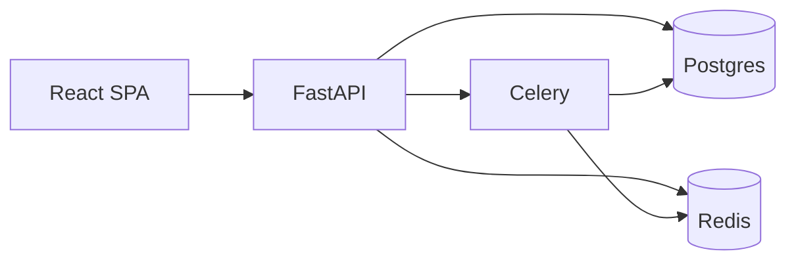

# InterviewAI Pro

AI-powered interview prep SaaS — FastAPI, React, Postgres, Redis, Celery.

> **Current milestone:** Module 16 — GitHub publish readiness  
> Architecture: [`docs/system-architecture.md`](docs/system-architecture.md) · Demo: [`docs/DEMO.md`](docs/DEMO.md) · Publish: [`docs/PUBLISH.md`](docs/PUBLISH.md)

Production-shaped monorepo you can run locally, walk through in an interview, and put on GitHub.

---

## Stack

| Layer | Tech |
|------|------|
| API | FastAPI + SQLAlchemy 2 + Alembic |
| Workers | Celery + Redis |
| DB | PostgreSQL 16 |
| Frontend | Vite + React + TypeScript + Tailwind |
| Gateway | Nginx (prod) |

---

## Quick start

```powershell
cp .env.example .env
docker compose up --build
docker compose exec api alembic upgrade head
docker compose exec api python -m app.db.seed
docker compose exec api python -m app.db.demo_seed
```

| Service | URL |
|---------|-----|
| Frontend | http://localhost:5173 |
| API docs | http://localhost:8000/docs |
| Health | http://localhost:8000/api/v1/health |

| Account | Password |
|---------|----------|
| `demo@interviewai.local` | `DemoPass1` |
| `admin@example.com` | `AdminPass1` |

Full walkthrough: [`docs/DEMO.md`](docs/DEMO.md)

---

## Architecture



Details: [`docs/system-architecture.md`](docs/system-architecture.md)

---

## What you can demo

- **Auth + RBAC** — JWT, refresh rotation, email verify, admin console
- **Resume ATS** — upload, parse, score, suggestions
- **AI interviews** — technical / behavioral / HR / **voice**
- **Coding lab** — problems + restricted Python/JS runners + Celery
- **Analytics** — radar, streaks, achievements
- **Reports** — PDF / Markdown / JSON + in-app notifications
- **AI Coach** — personalized study plans + chat
- **Company roadmaps** — Google, Amazon, Meta, and more with auto progress
- **Billing** — Free / Pro / Team with local activate or Stripe Checkout + webhook sync
- **Integrations** — Google/GitHub OAuth, SMTP email, optional S3 storage
- **Prod profile** — Nginx gateway, multi-stage Docker, GitHub Actions CI

<!-- Screenshots: add files under docs/screenshots/ then uncomment
## Screenshots

| Landing | Dashboard |
|---------|-----------|
|  |  |
-->

---

## Production-like local run

```powershell
docker compose -f docker-compose.prod.yml up --build -d
docker compose -f docker-compose.prod.yml exec api alembic upgrade head
docker compose -f docker-compose.prod.yml exec api python -m app.db.seed
docker compose -f docker-compose.prod.yml exec api python -m app.db.demo_seed
```

Open **http://localhost** — details in [`docs/production.md`](docs/production.md)

---

## Features by module

| Module | Capability | Docs |
|--------|------------|------|
| 1 | Scaffolding, health, compose | `docs/architecture.md` |
| 2 | Full schema + Alembic | `docs/database-er.md` |
| 3 | Auth (JWT, verify, reset) | `docs/authentication.md` |
| 4 | Users, RBAC, admin | `docs/users-admin.md` |
| 5 | Resume upload + ATS | `docs/resume-ats.md` |
| 6 | AI mock interviews | `docs/interviews.md` |
| 7 | Coding problems + runner | `docs/coding.md` |
| 8 | Analytics + achievements | `docs/analytics.md` |
| 9 | Reports + notifications | `docs/reports.md` |
| 10 | Prod compose + CI | `docs/production.md` |
| 11 | AI coach + study plans | `docs/coach.md` |
| 12 | Voice mock interviews | `docs/voice-interviews.md` |
| 13 | Company prep roadmaps | `docs/company-roadmaps.md` |
| 14 | Demo seed + showcase polish | `docs/DEMO.md` |
| 15 | Billing & plans | `docs/billing.md` |
| 16 | GitHub publish readiness | `docs/PUBLISH.md` |

---

## Useful commands

```powershell
docker compose exec api pytest -q
docker compose exec api python -m app.db.seed
docker compose exec api python -m app.db.demo_seed
docker compose restart frontend
```

---

## Contributing & security

- [`CONTRIBUTING.md`](CONTRIBUTING.md)
- [`SECURITY.md`](SECURITY.md)
- Publish checklist: [`docs/PUBLISH.md`](docs/PUBLISH.md)

---

## License

[MIT](LICENSE)
