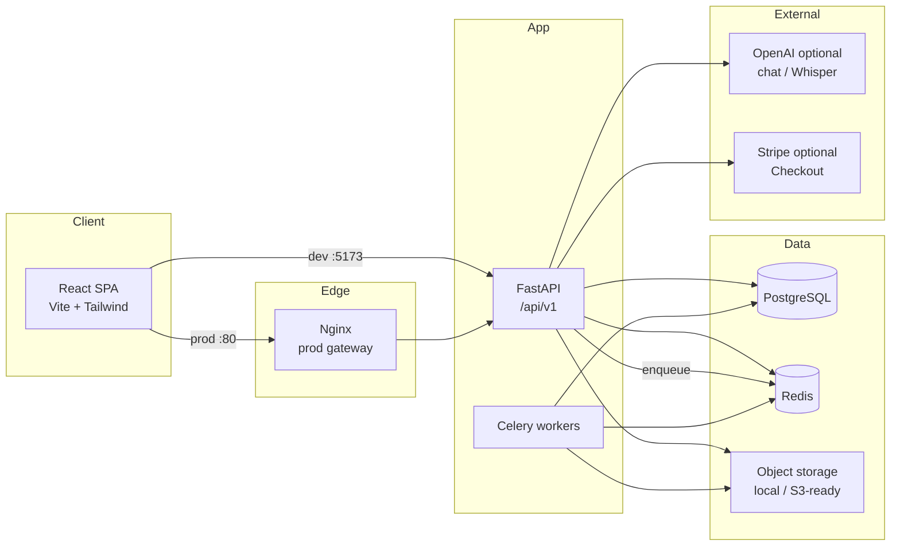
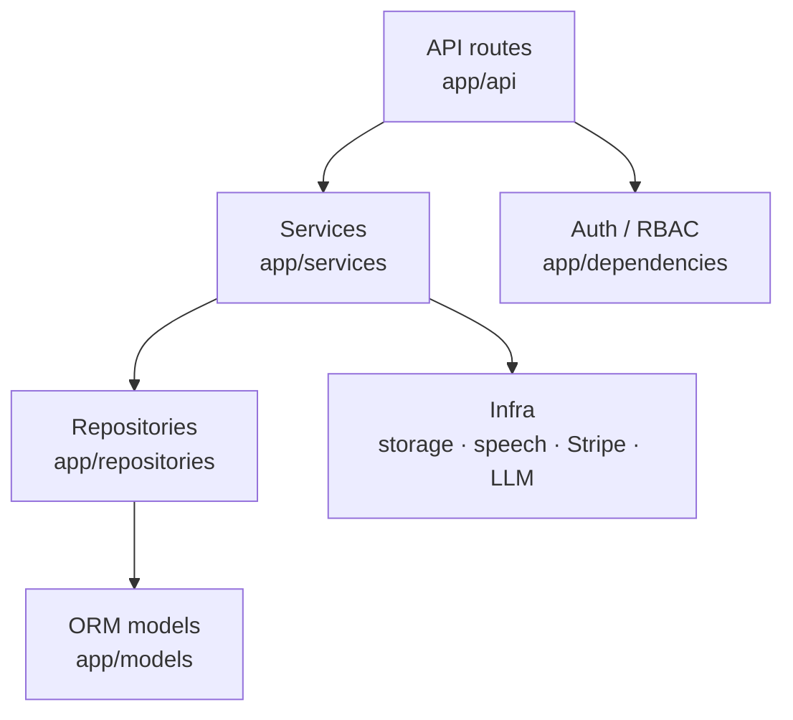
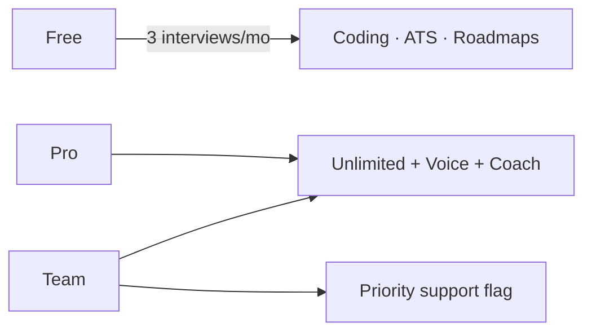

# System architecture (Modules 1–16)

High-level view of InterviewAI Pro for README embeds and system-design interviews.

## Runtime topology

## Backend layering

## Core product flows

| Flow | Path |
|------|------|
| Auth | Register → verify → JWT + refresh rotation |
| Resume ATS | Upload → parse → score → optional LLM tips |
| Interview | Create → answer → Celery/heuristic evaluate |
| Voice | TTS/STT browser → audio upload → Whisper/transcript → evaluate |
| Coding | Submit → restricted runner → verdict |
| Coach | Analytics → study plan tasks → chat |
| Roadmaps | Company catalog → enrollment → auto milestones |
| Billing | Plans → local activate or Stripe Checkout → entitlements |
| Reports | Bundle analytics → PDF/MD/JSON → notification |

## Entitlements (billing)

## Related docs

- Module history: [`architecture.md`](architecture.md) (Module 1 notes)
- ER sketch: [`database-er.md`](database-er.md)
- Production: [`production.md`](production.md)
- Publish checklist: [`PUBLISH.md`](PUBLISH.md)
